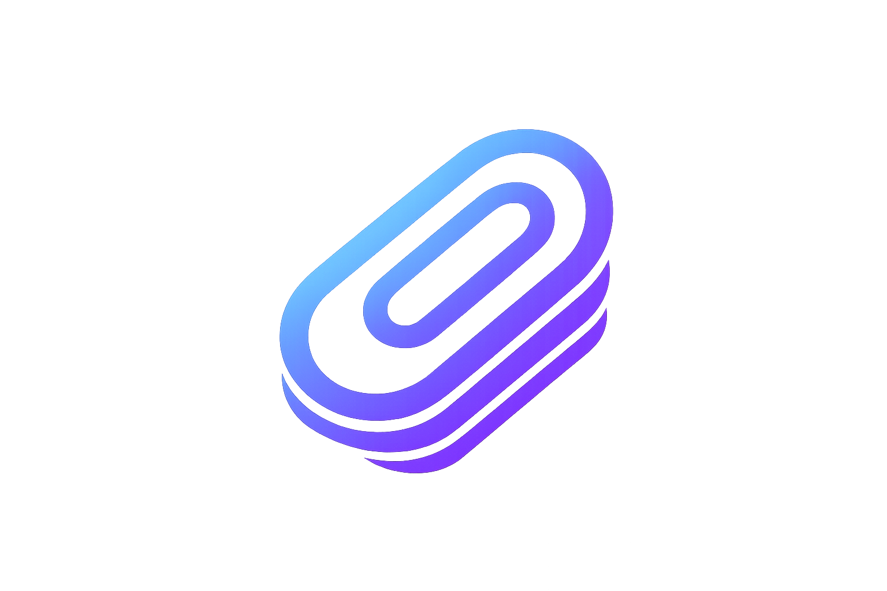

<div align="center">



# Pasteboard

**A lightweight clipboard manager for macOS that lives in your menu bar.**

[](https://www.apple.com/macos/)
[](https://swift.org)
[](LICENSE)

[**Download**](#-download) · [**Features**](#-features) · [**Install**](#-installation) · [**Build**](#%EF%B8%8F-building-from-source) · [**Permissions**](#-permissions)

</div>

---

## 📥 Download

<div align="center">

### [⬇ Download Pasteboard.app](https://github.com/nahid0-0/Pasteboard/raw/main/build/Pasteboard.app.zip)

`Apple Silicon` · `macOS 13.0 Ventura or later`

</div>

---

## ✨ Features

| | Feature | Description |
|---|---|---|
| 📋 | **Clipboard History** | Automatically tracks everything you copy |
| 🖼️ | **Screenshot Detection** | Captures screenshots and adds them to history |
| ⚡ | **Menu Bar Access** | Quick access via menu bar icon or global hotkey |
| 🔍 | **Search & Filter** | Find clips by type — Text, Image, URL, or File |
| 🔎 | **Rich Previews** | Preview clips with syntax highlighting |
| ⌨️ | **Keyboard First** | Configurable global hotkey & keyboard navigation |
| 📌 | **Pin Important Clips** | Keep your most-used clips at the top |
| 🗑️ | **Easy Management** | Delete individual items or clear all at once |
| 💾 | **Persistent Storage** | Your history survives app restarts |
| 🎨 | **Native Interface** | Clean, native macOS design that feels right at home |

---

## 🚀 Installation

1. **Download** the app using the link above
2. **Unzip** if downloaded as `.zip`
3. **Move** `Pasteboard.app` to your `/Applications` folder
4. **Launch** — right-click and select "Open" (first time only, to bypass Gatekeeper)
5. **Done** — the app appears in your menu bar ✨

---

## 🎯 Usage

| Action | How |
|---|---|
| Open clipboard history | Click the clipboard icon in the menu bar |
| Quick access | Use the global hotkey (configurable in Settings) |
| Copy an item | Click any item in the history |
| Filter by type | Use filter pills — Text, Image, URL, File |
| Search clips | Type in the search bar |
| Configure | Open Settings from the app |

---

## 🛠️ Building from Source

<details>
<summary><b>Requirements</b></summary>

- macOS 13.0 or later
- Xcode Command Line Tools
- Swift compiler

</details>

```bash
# Clone the repository
git clone https://github.com/nahid0-0/Pasteboard.git
cd Pasteboard

# Build
./build.sh

# Launch
open build/Pasteboard.app
```

---

## 🔐 Permissions

| Permission | Purpose | Required? |
|---|---|---|
| **Accessibility** | Capture global hotkeys | ✅ Required |
| **Screen Recording** | Detect and manage screenshots | ⚙️ Optional |

---

<div align="center">

**Made with ❤️ by [Nahid Rahman](https://github.com/nahid0-0)**

Copyright © 2026 Nahid Rahman. All rights reserved.

<br>

[](https://github.com/nahid0-0/Pasteboard/issues)
[](https://github.com/nahid0-0/Pasteboard/pulls)

</div>
